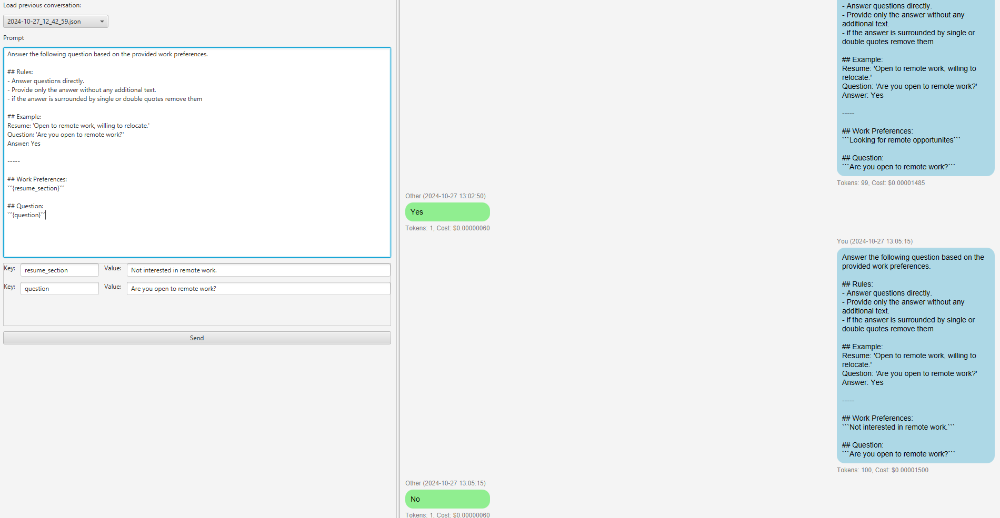

# OpenModelFX

OpenModelFX is a JavaFX application that allows users to interact with a conversational AI system. Users can load past conversations, send prompts with dynamic parameters, and view chat-style responses.

## Features

- Load previous conversations from a dropdown.
- Input prompts with placeholders and provide key-value pairs for dynamic replacement.
- Display chat messages in a conversational format, including time-stamped responses.
- Automatically saves conversation history to JSON files.
- Displays token count and cost information for each message.

## How to Use

- **Loading a conversation**: Select a saved conversation from the dropdown to view the previous chat.
- **Sending a prompt**: Type your message in the text area. If your prompt includes placeholders (e.g., {name}), fields will appear to enter the corresponding values.
- **Viewing responses**: The responses from the AI will appear in chat bubbles below the input area, along with token count and cost information.

## FXML Layout

The user interface is split into two main sections:
- A text area for user input and parameter fields.
- A scrollable chat window for displaying the conversation history.

## Images

## License

This project is licensed under the MIT License.